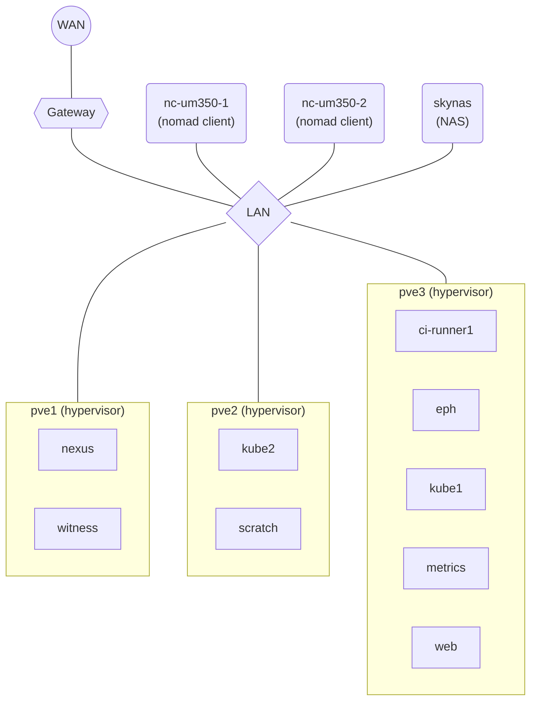

# homelab

- `ansible`: My ansible config to capture telemetry and syslogs from Raspberry
  Pis.
- `baseimage`: Flakes for generating minimal NixOS images for VMs and SD cards.
- `esphome`: My esphome (ESP32 + Home Assistant) configs.
- `nixos`: My NixOS home lab system configs flake.

## Diagrams

### Machines

